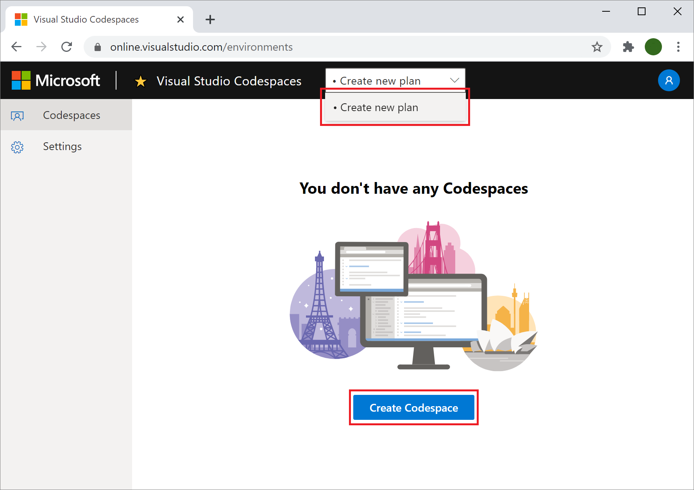
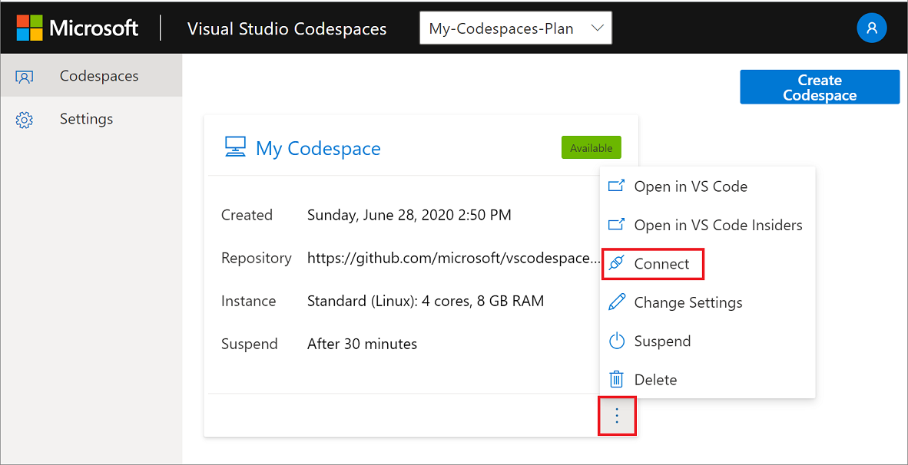
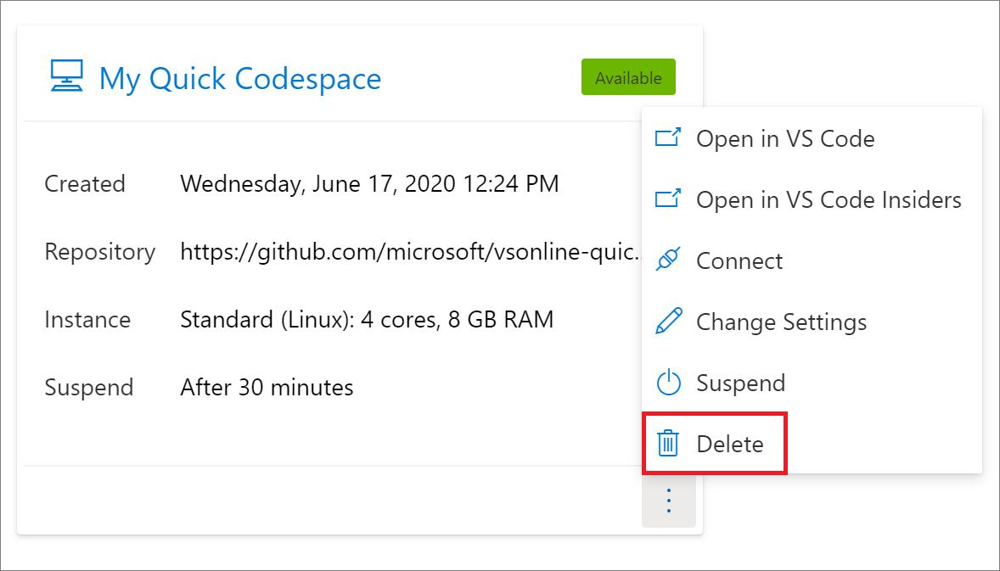
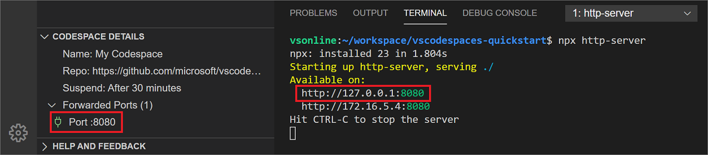
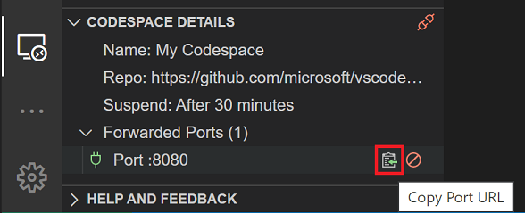

# Visual Studio Codespaces Browser How-to

> [!IMPORTANT] 
> Visual Studio Codespaces is being consolidated into [GitHub Codespaces](https://github.com/features/codespaces). New user signups and codespace creation suspended on December 16th, 2020. The service will be retired and all data deleted on February 17th, 2021. See our [FAQs](https://docs.microsoft.com/visualstudio/codespaces/resources/consolidation-faq#im-a-current-visual-studio-codespaces-user-how-do-i-move-to-the-github-beta) for guidance on your transition to GitHub Codespaces.

## Sign up

> [IMPORTANT]
> New user signups suspended on December 16, 2020.

A Microsoft Account and Azure Subscription are required to use Visual Studio Codespaces.

You can sign up for both, as well as receive various Azure incentives at [https://azure.microsoft.com/free/](https://azure.microsoft.com/free/).

## Sign in

To sign into Visual Studio Codespaces, browse to the [login page](https://online.visualstudio.com/login) and click the **Sign in** button.

Follow the prompts in the pop-up dialog to complete sign in.

## Create a plan

> [IMPORTANT]
> New plan creation suspended on December 16, 2020.

Once you've [signed up](#sign-up) and created an Azure subscription, you can access Codespaces by creating a Codespaces Plan. You can create more than one plan, and plans can be used to group related codespaces together. They are also the unit of billing, and as such you'll see a line item on your Azure bill for each plan you create.

More information about plans and pricing is available on the [Visual Studio Codespaces pricing](https://aka.ms/vso-pricing) page.

To create a new plan, browse to the [Codespaces management portal](https://online.visualstudio.com/environments) and either using the blue **Create Codespace** button (if it's available), or by clicking the **Create new plan** in the **Plan Selector** dropdown in the header bar.

Fill in the form to select an Azure subscription to associate the plan with and an Azure region to geo-locate the plan in.

- **Subscription**: You can choose from any existing Azure subscription.
- **Location**: Choose an [Azure region](https://azure.microsoft.com/global-infrastructure/regions/) to create the Codespaces Plan in. All codespaces created within this plan, will be provisioned in the location selected. 
 
Supported regions are:
  - East US
  - Southeast Asia
  - West Europe
  - West US 2

And under **Advanced Options**, you can leave the automatically generated values or set your own for:

- **Plan Name**: For example: "My-Codespaces-Plan"
- **Resource Group**: Choose any existing Azure resource group you'd like. A new resource group will be created if an existing one isn't specified.
- **Default Instance Type**: Choose the default Codespaces Instance Type, such as Standard (Linux).

Once a plan is created, it will be the selected plan in the **Plan Selector**.

Only codespaces contained within the selected plan will be displayed. To select a different plan, use the **Plan Selector** menu.

## Create a codespace

> [IMPORTANT]
> New codespace creation suspended on December 16, 2020.

To create a new cloud-hosted codespace, fill in the **Create Codespace** form. The form will be shown after you create a plan if you selected the **Create Codespace** button earlier or by selecting the **Create Codespace** button now in the Codespaces management portal.

Complete the form to provide a codespace name, path to Git repository (optional), auto-suspend settings, and an instance type.

- **Codespace Name**: You can name your codespace anything you'd like, but we recommend naming it after the project or task that you'll be using it for. (for example 'TODO App Codespace', 'PR Review', 'Shopping Cart Feature')
- **Git Repository**: If a path to a Git repository is provided, Codespaces will automatically clone that repository into the codespace. You can refer to our [repository reference](../reference/repository.md) on the supported URL types and providers.
- **Instance Type**: The CPU and memory configuration that will be provisioned for your codespace. Choose **Standard (Linux)** for most projects, and **Premium (Linux)** for those that require a little extra power. More information about instance types is available at our [pricing page](https://aka.ms/vso-pricing).
- **Suspend idle Codespace after...**: The length of disconnected time before a codespace will be automatically suspended. Choose between:
  - 5 minutes
  - 30 minutes
  - 2 hours

> [!TIP]
> The guided codespace creation experience described above supports Git repositories over the HTTP(S) scheme. To use another source control provider, or Git over SSH, simply leave the **Git Repository** setting blank, and use the codespaces's terminal support to clone your source code.
> [!NOTE]
> Optional dotfiles configuration options are covered in the [Personalizing codespaces](../reference/personalizing.md) reference document.

Once you've filled in the form, select **Create**. This will begin creating your codespace and open the codespace in your browser when it is finished.

## Connect to a codespace

If you go back to the management portal, there will be a new card with the name of your new codespace and a status badge of **Available**.

From there, you can either click on the name of the codespace (**My Codespace** in this screenshot) or, right-click for the context menu and select **Connect**. Taking either of these actions will cause your browser to navigate to Codespaces's browser-based editor and begin the connection sequence. When the connection is complete, you'll be able to inspect details about the currently selected codespace in the **Codespace Details** panel in the **Remote Explorer** side bar.

> [!NOTE]
> If you are already connected to a codespace in the browser-based editor, you can connect to another codespace using any of the techniques covered in the [Visual Studio Code how-to](vscode.md#connect-to-a-codespace) document.

## Disconnect from a codespace

Once connected to a codespace, there's four ways to disconnect:

1. Use the **Codespaces: Disconnect** command in the [Command Palette](https://code.visualstudio.com/docs/getstarted/userinterface#_command-palette).
2. Right-click the name of the connected codespace in the **Codespaces** panel to reveal a context menu with a **Disconnect** option.
3. Selecting the **Disconnect** button on the **Codespace Details** title bar in the **Remote Explorer** side bar.
4. Close the browser tab.

## Suspend a codespace

As described on the [Codespaces pricing page](https://aka.ms/vso-pricing), you pay for active Codespaces usage, with a nominal fee for when an codespace is suspended.

Codespaces will automatically suspend an inactive codespace according to the auto-suspend setting used when the codespace was created. This helps keep the costs of codespaces as low as possible.

In addition to auto-suspending, you can manually suspend a codespace at any time by using the **Codespaces: Suspend Codespace** command in the Command Palette, or by selecting **Suspend Codespace** in the right-click context menu on any codespace listed in the **Codespaces** panel of the **Remote Explorer** side bar.

Codespaces can also be suspended in Codespaces's management portal by clicking the context menu and selecting **Suspend**.

## Delete a codespace

The actively connected codespace cannot be deleted from within Codespaces's browser-based editor, instead, it can be deleted in the management portal by clicking the context menu and selecting **Delete**.

> [!NOTE]
> If you are already connected to a codespace in Codespaces's browser-based editor, you can delete other codespaces using the techniques covered in the [Visual Studio Code how-to](vscode.md#delete-a-codespace) document.

## Using the integrated terminal

Codespaces's browser-based version of VS Code includes support for VS Code's integrated terminal and all of its features. It is important to note, however, that while connected to Codespaces, commands issued in the terminal are executed against the codespace, not the user's local machine. This provides Codespaces users full control over their development environment and how it's configured.

> [!TIP]
> The [integrated terminal is fully documented on the VS Code site](https://code.visualstudio.com/docs/editor/integrated-terminal).

In addition to the standard integrated terminal features of VS Code, Codespaces also allows for the terminal to be personalized using custom dotfiles. See [Personalizing codespaces](../reference/personalizing.md) for more information.

## Port forwarding

Visual Studio Codespaces provides access to the applications and services running in remote environments by means of port forwarding. By default, no ports are forwarded for security concerns, however, there are several ways to open ports in the remote environment.

### Auto port forwarding

If your application, or any other, indicates that it is serving content from a local port in the integrated terminal, Codespaces will automatically forward that port and add it to the list of **Forwarded Ports** under **Codespace Details**.

In the example below, `npx` is used to run `http-server`, which opens port `8080`. Codespaces correspondingly and automatically forwards port `8080` so it can be accessed from your local environment.

### Port forwarding interface

As with all operations in Codespaces, you can use the Command Palette to forward a port. Select the **Codespaces: Forward Port** command and follow its prompts: typing in a port number to forward, and to assign an optional name to the port forwarding rule.

Additionally, you can click the **Forward Port** button on the **Forwarded Ports** title bar in the **Codespace Details** panel.

### Configure port forwarding

If there's one or more ports that should be forwarded by default for a given repository, that can be configured in `devcontainer.json`. See the [configuring codespaces](../reference/configuring.md) reference for more info.

### Access forwarded ports

Once a port has been forwarded, you can click the **Copy Port URL** button on the port's title bar in the **Codespace Details** panel. This will copy the full URL to the port into your clipboard so you can paste it into a browser, CLI, or the API exploration tool of your choice.

### Stop forwarding ports

There's two ways to stop a forwarded port, regardless of which mechanism was used to create it. You can either use the **Codespaces: Stop Forwarding Port** command in the Command Palette, or select the **Stop Forwarding Port** button on the port's title bar in the **Codespace Details** panel.

## Configuration and personalization

In addition to the above documentation that's specific to Codespaces's browser-based experience, Codespaces also provides flexible mechanisms to customize codespaces on a per repository basis, as well as to personalize them on a per user basis. Find out more in the reference documentation:

- [Configuring codespaces](../reference/configuring.md)
- [Personalizing codespaces](../reference/personalizing.md)
