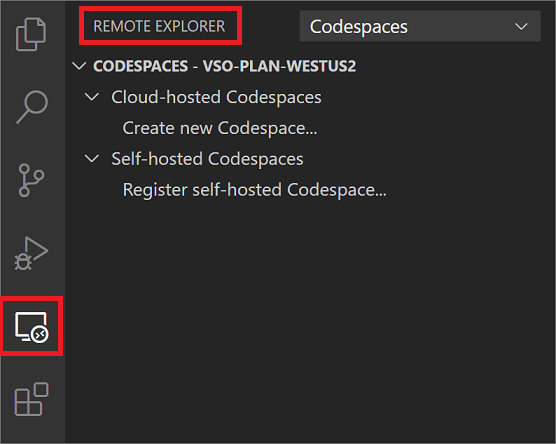
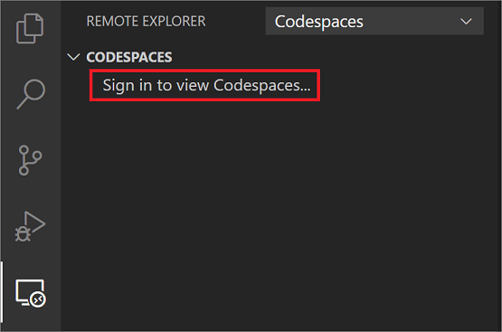
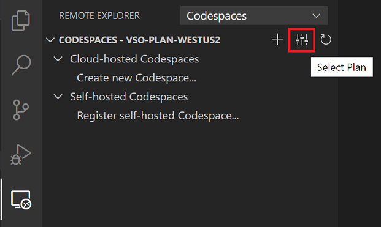
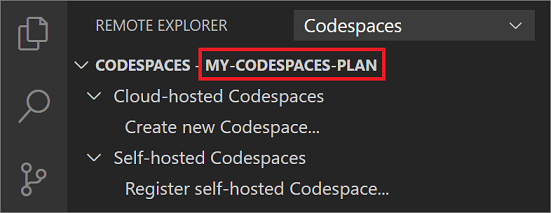
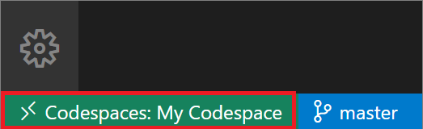
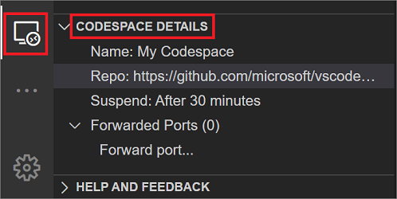
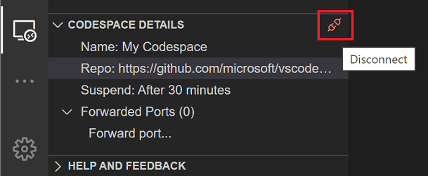
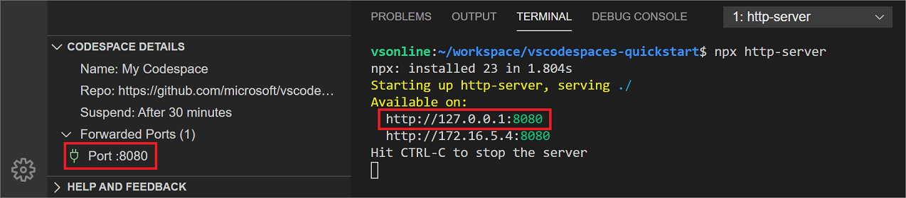
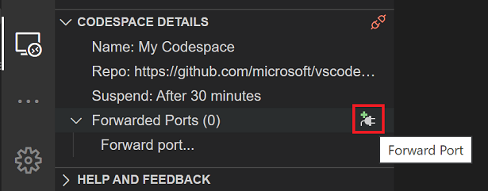
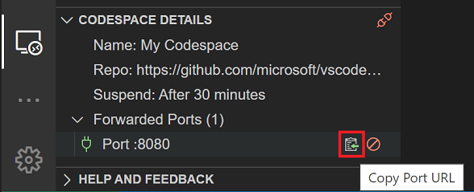

# Visual Studio Codespaces VS Code How-to

This article covers how to get started using VS Code with Visual Studio Codespaces.

## Sign up

A Microsoft Account and Azure Subscription are required to use Visual Studio Codespaces. You can sign up for both at [https://azure.microsoft.com/free/](https://azure.microsoft.com/free/).

## Install

If you don't have [Visual Studio Code](https://code.visualstudio.com/) installed already, you can [download it from code.visualstudio.com](https://code.visualstudio.com/download).

If you'd like to use Codespaces from within Visual Studio Code, you'll have to install the Codespaces extension. There are two ways to do that:

### Install the Codespaces extension from the VS Code Marketplace

You can install the [Codespaces extension](https://aka.ms/vso-dl) from the [VS Code Marketplace](https://marketplace.visualstudio.com/VSCode) by clicking on the green install button near the top of the page and following the prompts.

<!-- TODO: SCREENSHOT NEEDED 1 -->

### Install the extension from within VS Code

Alternatively, from within VS Code search for "Visual Studio Codespaces" within the **Extensions** view, select the extension from the list, and press the **Install** button.

<!-- TODO: SCREENSHOT NEEDED 2 -->

### Use the Visual Studio Codespaces panel

When successfully installed, the **Codespaces** panel will be available in the **Remote Explorer** pane. If you have other VS Code Remote Development extensions installed, you may need to select **Codespaces** from the **Remote Explorer** dropdown.

This panel provides a management interface for interacting with codespaces, and is covered in full detail in the remainder of this document.

In addition to the panel, VS Code will also show the remote indicator in the Status bar when the Codespaces extension is installed. The remote indicator signals your connection status, and provides a list of available Codespaces commands when clicked.

## Sign in to Visual Studio Codespaces

To sign in to Visual Studio Codespaces, you can either press **F1** and select the **Codespaces: Sign In** command in the [Command Palette](https://code.visualstudio.com/docs/getstarted/userinterface#_command-palette), or click **Sign in to view Codespaces...** in **Codespaces** panel of the **Remote Explorer** side bar.

<!-- TODO: 
Add content for:
- Filtering Azure Subscription
-->

## Create a plan

Once you've [signed up](#sign-up) and created an Azure subscription, you can access Codespaces by creating a Codespaces Plan. You can create more than one plan, and plans can be used to group related codespaces together. They are also the unit of billing, and as such you'll see a line item on your Azure bill for each plan you create. For more information about plans and pricing, see [Codespaces pricing](https://aka.ms/vso-pricing).

The first time you [create a codespace](#create-a-codespace), VS Code will automatically walk you through the steps required to create a plan. To explicitly create a new plan, you can either use the **Codespaces: Create Plan** command in the [Command Palette](https://code.visualstudio.com/docs/getstarted/userinterface#_command-palette), or by clicking the **Select Plan** button on the **Codespaces** title bar in the **Remote Explorer** side bar, then selecting **Create new plan...** from the quick pick list.

Follow the prompts to select an Azure subscription to associate the plan with, an Azure region to create the plan in, a name for the Azure resource group to create the plan in, and a name for the plan itself.

- **Azure subscription**: You can choose from any Azure subscriptions that was previously selected. To add or remove options from the list, use the **Azure: Select Subscriptions** command in the Command Palette.
- **Azure resource group name**: Your Codespaces plan will be created in a new Azure resource group with the name provided in this step.
- **Azure region**: Choose an [Azure region](https://azure.microsoft.com/global-infrastructure/regions/) to create the Codespaces plan in. All codespaces created within this plan will be provisioned in the region selected. Supported regions are:
  - East US
  - Southeast Asia
  - West Europe
  - West US 2
- **Codespaces plan name**: The name of the created Codespaces Plan. This name is displayed in the **Remote Explorer** for organization purposes.
- **Default instance type**: Choose the default Codespaces Instance Type, such as Standard (Linux).

Once a plan is created, it will be the selected plan in the **Remote Explorer**.

Only codespaces contained within the selected plan will be displayed. To select a different plan, you can either use the **Codespaces: Select Plan** command in the Command Palette, or by clicking the **Select Plan** button on the **Codespaces** title bar.

## Create a codespace

>[!TIP]
> If you've already got a configured development environment or need specialized hardware Codespaces doesn't currently support, you can self-host Visual Studio Codespaces. For more information, see [Register a self-hosted Codespaces environment](self-hosting-vscode.md).

Codespace environments are extremely configurable. For advanced information about how to configure your codespace, see [Configure Codespace environments](../reference/configuring.md).

To create a new codespace in VS Codespaces, you can either use the **Codespaces: Create New Codespace** command in the [Command Palette](https://code.visualstudio.com/docs/getstarted/userinterface#_command-palette), or by selecting the **Create New Codespace** button on the **Codespaces** title bar in the **Remote Explorer** side bar.

In the quick pick that appears, you can choose to either take the default settings, set custom setting values, or review pricing information.

Next you have the option to set a repository. You can refer to the [repository reference](../reference/repository.md) for the supported repository URL types and providers.

Finally you will be prompted to give a name for your codespace. Once you provide a name, Codespaces will begin creating your codespace and you will see a **Creation Log** view displaying progress.

### Codespace settings

- **Name**: Name your codespace after the project or task that you'll be using it for. (for example, 'TODO App Codespace', 'PR Review', 'Shopping Cart Feature')
- **Git Repository**: If a path to a Git repository is provided, Codespaces will automatically clone that repository into the codespace. You can specify a Git repository in one of many formats:
  - **Absolute HTTP(S) Git URL**: A complete HTTP or HTTPS URL. It may end in a `.git` extension. Examples include:
    - https://github.com/organization/repo.git
    - https://organization@dev.azure.com/organization/repo/_git/repo
    - https://username@bitbucket.org/organization/repo.git
  - **GitHub Project URL**: The HTTPS URL used to navigate to the homepage of a project on GitHub. (for example https://github.com/organization/repo)
  - **GitHub Short Form**: The forward slash delimited `organization/repo` format used to refer to projects on GitHub.
  - **GitHub Pull Request URL**: The HTTPS URL used to navigate to a pull request in GitHub. (for example https://github.com/organization/repo/pull/123)
- **Auto-suspend Setting**: The length of disconnected time before a codespace will be automatically suspended. Choose between:
  - 5 minutes
  - 30 minutes
  - 2 hours
- **Instance Type**: The CPU and memory configuration that will be provisioned for your codespace. Choose **Standard (Linux)** for most projects, and **Premium (Linux)** for those that require a little extra power. More information about instance types is available at our [pricing page](https://aka.ms/vso-pricing).

The guided codespace creation experience described above supports Git repositories over the HTTP(S) scheme. To use another source control provider, or Git over SSH, simply leave the **Git Repository** setting blank, and use the codespace's terminal support to clone your source code.

> [!NOTE]
> Windows based instance types are available as part of our Codespaces for Visual Studio Private Preview. [Sign up](https://aka.ms/vsfutures-signup) to receive access.

## Connect to a codespace

If you were already connected to a codespace when you last shut down VS Code, it will automatically try to re-connect to that codespace when you launch it.

If you're [creating a codespace](#create-a-codespace), a **Creation Log** view will appear with a **Connect** button as soon as the codespace is ready. Select the **Connect** button to connect to the new codespace.

<!-- TODO screenshot of Creation Log -->

When you're in the process of connecting, VS Code's **Remote Indicator** will animate during the connection process, and will display the name of the codespace once the connection has completed.

To connect to an already existing codespace, that you're not currently connected to, there are several options:

1. Use the **Codespaces: Connect to Codespace** command in the [Command Palette](https://code.visualstudio.com/docs/getstarted/userinterface#_command-palette) to display with a quick pick list of codespaces.
2. Use the **Connect to Codespace** button when you select any codespace in the **Codespaces** panel in the **Remote Explorer**.
3. For more advanced options, right-click the name of the codespace in the **Codespaces** panel to reveal a context menu with the following options:
   - **Connect to Codespace**: Click to immediately connect to the selected codespace.
   - **Open Codespace in New Window**: Click to launch a new VS Code instance that will connect to the selected codespace. This is useful for being connected to multiple codespaces at once.
   - **Open in Browser**: Click to launch the codespace in VS Codespaces's browser-based editor.

Once you've connected to a codespace, you can inspect details about the current codespace in the **Codespace Details** panel in the **Remote Explorer** side bar.

## Disconnect from a codespace

Once connected to a codespace, there are four ways to disconnect:

1. Use the **Codespaces: Disconnect** command in the [Command Palette](https://code.visualstudio.com/docs/getstarted/userinterface#_command-palette).
2. Right-click the name of the connected codespace in the **Codespaces** panel to reveal a context menu with a **Disconnect** option.
3. Select the **Disconnect** button on the **Codespace Details** title bar in the **Remote Explorer** side bar.
4. Close VS Code

## Suspend a codespace

As described on the [Codespaces pricing page](https://aka.ms/vso-pricing), you pay for active Codespaces usage, with a nominal fee for when a codespace is suspended.

Codespaces will automatically suspend an inactive codespace according to the auto-suspend settings configured when the codespace was created. This helps reduce the cost of codespaces.

In addition to auto-suspending, you can manually suspend a codespace at any time by using the **Codespaces: Suspend Codespace** command in the Command Palette, or by selecting **Suspend Codespace** in the right-click context menu on any codespace listed in the **Codespaces** panel of the **Remote Explorer** side bar.

<!-- TODO: Add context menu screenshot -->

## Delete a codespace

The actively-connected codespace cannot be deleted from within VS Code, however while [disconnected from a codespace](#disconnect-from-a-codespace), there are two ways to permanently delete it:

1. Use the **Codespaces: Delete Codespace** command in the [Command Palette](https://code.visualstudio.com/docs/getstarted/userinterface#_command-palette) to select the codespace to be deleted then press the **Delete** button on the confirmation prompt.
2. Right-click the name of the disconnected codespace in the **Codespaces** panel to reveal a context menu with a **Delete Codespace** option. Select it and press the **Delete** button on the confirmation prompt.

## Use the integrated terminal

VS Code's integrated terminal and all of its features are fully supported in a Codespace. It is important to note, however, that while connected to a codespace, commands issued in the terminal are executed against the codespace and not the local machine. This provides control over the codespace environment and how it's configured.

> [!TIP]
> The [integrated terminal is fully documented on the VS Code site](https://code.visualstudio.com/docs/editor/integrated-terminal).

In addition to the integrated terminal features of VS Code, Codespaces also allows for the terminal to be personalized using custom dotfiles. See [Personalizing codespaces](../reference/personalizing.md) for more information.

## Port forwarding

Visual Studio Codespaces provides access to the applications and services running in the remote environments by means of port forwarding. By default, no ports are forwarded for security concerns. However, there are several ways to open ports in the codespace.

### Auto port forwarding

If your application, or any other, indicates that it is serving content from a local port in the integrated terminal, Codespaces will automatically forward that port and add it to the list of **Forwarded Ports** under **Codespace Details**.

In the example below, `npx` is used to run `http-server`, which opens port `8080`. Codespaces correspondingly and automatically forwards port `8080` so it can be accessed from your local environment.

### Port forwarding interface

As with all operations in Codespaces, you can use the Command Palette to forward a port. Select the **Codespaces: Forward Port** command and follow its prompts: typing in a port number to forward, and to assign an optional name to the port forwarding rule.

Additionally, you can click the **Forward Port** button on the **Forwarded Ports** title bar in the **Codespace Details** panel.

### Configure port forwarding

If there's one or more ports that should be forwarded by default for a given repository, that can be configured in `devcontainer.json`. See the [configuring codespaces](../reference/configuring.md) reference for more info.

### Access forwarded ports

Once a port has been forwarded, you can click the **Copy Port URL** button on the port's title bar in the **Codespace Details** panel. This will copy the full URL to the port into your clipboard so you can paste it into a browser, CLI, or the API exploration tool of your choice.

### Stop forwarding ports

There's two ways to stop a forwarded port, regardless of which mechanism was used to create it. You can either use the **Codespaces: Stop Forwarding Port** command in the Command Palette, or select the **Stop Forwarding Port** button on the port's title bar in the **Codespace Details** panel.

## Configure and personalize advanced settings

In addition to the above documentation that's specific to VS Code's Codespaces extension, Visual Studio Codespaces also provides flexible mechanisms to customize codespaces on a per repo basis, as well as to personalize them on a per user basis. Find out more in the reference documentation:

- [Configuring codespaces](../reference/configuring.md)
- [Personalizing codespaces](../reference/personalizing.md)
