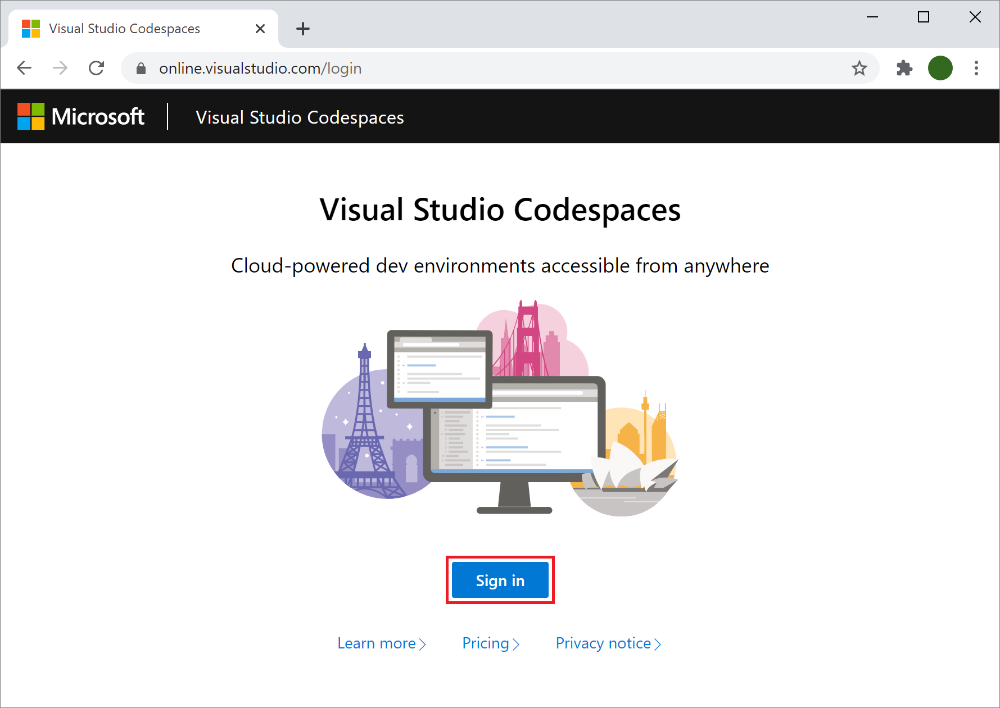

# Visual Studio Codespaces Quickstart

Visual Studio Codespaces provides cloud-powered development environments for any activity - whether it's a long-term project, or a short-term task like reviewing a pull request. You can work with these environments from Visual Studio Code, Visual Studio 2019 ([sign up for the Private Preview](https://aka.ms/vsfutures-signup)), or a browser-based editor that's accessible anywhere! You can even connect your own self-hosted environments to Visual Studio Codespaces at no cost.

Additionally, Visual Studio Codespaces brings many of the benefits of DevOps, like repeatability and reliability, which have typically been reserved for production workloads, to development environments. However, Visual Studio Codespaces is also personaliazable to allow developers to leverage the tools, processes, and configurations that they have come to love and rely on - truly the best of both worlds!

This document will walk you through how to install Codespaces, create a cloud-hosted environment, connect to it, run and debug the environment's application, disconnect and delete the environment.

> [!IMPORTANT]
> A Microsoft Account and Azure Subscription are required for this quickstart. You can sign up for both, as well as receive various Azure incentives at [https://azure.microsoft.com/free/](https://azure.microsoft.com/free/).

## 1. Sign in

To sign into Codespaces, browse to the [login page](https://online.visualstudio.com/login) and click the **Sign in** button.

Follow the prompts in the pop-up dialog to complete sign in.

## 2. Create a plan

A Codespaces plan is required to create Codespaces environments. To create a new plan, use either the **Create new plan** item in the **Plan Selector** menu in the header bar or the **Create Codespace** button, which will create a new plan as part of the create codespace workflow.

Fill in the form with the following information:

- **Subscription**: Choose any existing Azure subscription you'd like.
- **Location**: Choose the supported regions geographically closest to you. Supported locations are:
  - East US
  - Southeast Asia
  - West Europe
  - West US 2

And under **Advanced Options**, you can leave the automatically generated values or set your own for:

- **Plan Name**: For example: "My-Codespaces-Plan"
- **Resource Group**: Choose any existing Azure resource group you'd like. A new resource group will be created if an existing one isn't specified.
- **Default Instance Type**: Choose the default Codespaces Instance Type, such as Standard (Linux).

Once a plan is created, it will be the selected plan in the **Plan Selector**.

> [!TIP]
> More information about plans and pricing is available on the [Codespaces pricing page](https://aka.ms/vso-pricing).

## 3. Create a codespace

To create a new cloud-hosted codespace, fill in the **Create Codespace** form. The form will be shown after you create a plan if you selected the **Create Codespace** button earlier or by selecting the **Create Codespace** button now in the Codespaces management portal.

Complete the form with the following values:

- **Codespace Name**: My Quick Codespace
- **Git Repository**: microsoft/vsonline-quickstart
- **Instance Type**: Standard (Linux)
- **Suspend idle Codespace after...**: 30 minutes

> [!TIP]
> [Sign up for the Private Preview](https://aka.ms/vsfutures-signup) to create Windows based Codespaces.

Once you've filled in the form, select **Create**. This will begin creating your codespace and open the codespace in your browser when it is finished.

If you go back to the management portal, there will be a new card with the name **My Quick Codespace** and a status badge of **Available**.

## 4. Working in your codespace

The codespace will have several editors open; the **Welcome** page, the quickstart repository's `README.md`, as well as the codespace **Creation Log** in a side editor group.

Close the **Creation Log** and select the `README.md` editor tab. You can then press **Ctrl** + **Shift** + **V** to render the Markdown file.

Follow the instructions in `README.md`, and return to this document when complete.

You can return to the Codespaces management portal with your browser's back navigation. To reconnect to the codespace, select the **My Quick Codespace** link in the codespace card.

## 5. Delete the codespace

To delete the newly created codespace, open the **More** options menu in the lower right of the **My Quick Codespace** card and select **Delete**.

## Next steps

This article covered a typical end-to-end use of Codespaces. For more information, see:

- [What is Visual Studio Codespaces?](../overview/what-is-vsonline.md)
- [Codespaces with Visual Studio 2019 quickstart](../quickstarts/vs.md)
- [Codespaces with VS Code quickstart](../quickstarts/vscode.md)
