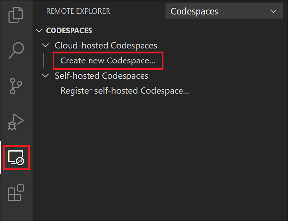
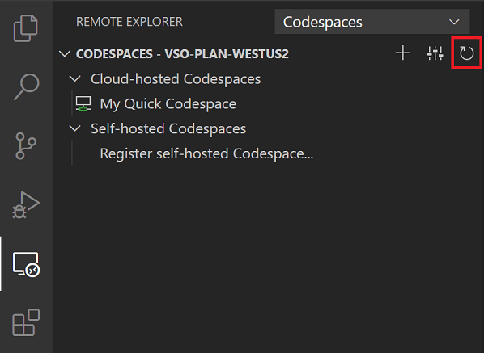
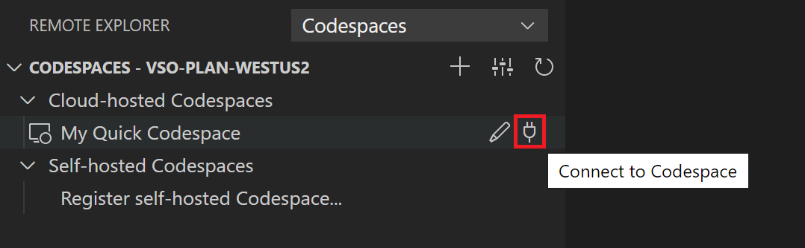

# Visual Studio Codespaces VS Code Quickstart

Visual Studio Codespaces provides cloud-powered development environments for any activity - whether it's a long-term project, or a short-term task like reviewing a pull request. You can work with these environments from Visual Studio Code, Visual Studio 2019 ([sign up for the Private Preview](https://aka.ms/vsfutures-signup)), or a browser-based editor that's accessible anywhere! You can even connect your own self-hosted environments to Visual Studio Codespaces at no cost.

Additionally, Visual Studio Codespaces brings many of the benefits of DevOps, like repeatability and reliability, which have typically been reserved for production workloads, to development environments. However, Visual Studio Codespaces is also personalizable to allow developers to leverage the tools, processes and configurations that they have come to love and rely on - truly the best of both worlds!

This document will walk you through how to install the Codespaces extension, create a cloud-hosted environment, connect to it, run and debug the environment's application, disconnect and delete the environment.

> [!IMPORTANT]
> You must sign up for the Private Preview and have an Azure Subscription to try this quickstart. If you don't already have an Azure Subscription, create one at [https://azure.microsoft.com/free/](https://azure.microsoft.com/free/).

## 1. Install

> [!TIP]
> If you don't have [Visual Studio Code](https://code.visualstudio.com/) installed already, you can find the download for your operating system on the [Visual Studio Code Download](https://code.visualstudio.com/download) page.

Install the [Codespaces extension](https://aka.ms/vso-dl) for Visual Studio Code by clicking on the green install button near the top of the Marketplace page and following the prompts.

Once installed, you can sign in.

## 2. Sign in

To sign into Codespaces, you press **F1** and select the **Codespaces: Sign In** command in the [Command Palette](https://code.visualstudio.com/docs/getstarted/userinterface#_command-palette). Follow the prompts in your browser to complete the sign in.

## 3. Create a codespace

To create a new cloud-hosted codespace in Codespaces, select **Create new Codespace...** in the **Codespaces** view in the **Remote Explorer** side bar. If you have other VS Code Remote Development extensions installed, you may need to select **Codespaces** from the **Remote Explorer** dropdown.

> [!NOTE]
> If you don't have the [Azure Account](https://marketplace.visualstudio.com/items?itemName=ms-vscode.azure-account) extension installed, you will be prompted to install it before proceeding. In the Extensions view, search for 'Azure Account' and select **Install**. You may need to restart VS Code after installing the Azure Account extension.

In the quick pick that appears, you can choose to either take the default settings, set custom setting values, or review pricing information. For this quickstart, take the **Default settings**.

Next you will be prompted to select an Azure subscription. Choose any existing Azure subscription you'd like.

Next you have the option to set a repository. For this quickstart, we'll use the Codespaces quickstart repo `microsoft/vscodespaces-quickstart`. You can refer to the [repository reference](../reference/repository.md) for the supported repository URL types and providers.

Finally you will be prompted to give a name for your codespace, such as "My Quick Codespace". Once you provide a name, Codespaces will begin creating your codespace and you will see a **Creation Log** view displaying progress.

> [!TIP]
> [Sign up for the Private Preview](https://aka.ms/vsfutures-signup) to create Windows-based codespaces.

## 4. Review your codespace

Refresh the **Remote Explorer** using the **Refresh** button in the **Codespaces** title bar and you'll see your codespace under **Cloud-hosted Codespaces**. You'll also notice that the **Codespaces** title bar has changed to include the Codespaces Plan name. 

Below there is the generated Codespaces Plan name, **vso-plan-westus2**, reflecting the region the codespace was created in.

The hover for the new codespace displays the name, when it was created, the optional repository, and how long the codespace can be idle before it is suspended.

## 4. Connect and use the codespace

When you hover over **My Quick Codespace** item in the **Remote Explorer**, there are two buttons to let you **Change Codespace Settings** and **Connect to Codespace**. 

After selecting the **Connect to Codespace** button, VS Code will connect to the cloud-hosted codespace just created. The name **My Quick Codespace** will appear in the **Remote Indicator** in the bottom left corner of the Status bar when you are fully connected. Clicking on the **Codespaces: My Quick Codespace** Status bar item will display a dropdown with appropriate Codespaces commands.

At this point, open `README.md` from the **File Explorer**, and then press **Ctrl**+**Shift**+**V** to render the Markdown file.

Follow the instructions in `README.md`, and return to this document when complete. 

You can disconnect from your codespace by using the **Codespaces: Disconnect** command available in the Command Palette or **Remote Indicator** dropdown or by hovering over **My Quick Codespace** in the **Remote Explorer** and selecting the **Disconnect** button.

## 5. Delete the codespace

To delete the newly created codespace, right-click on **My Quick Codespace** in the **Codespaces** panel of the **Remote Explorer** and select **Delete Codespace** from the context menu.

## Next Steps

This article covered a typical end-to-end use of Codespaces. For more information, see:

- [What is Visual Studio Codespaces?](../overview/what-is-vsonline.md)
- [Codespaces with Visual Studio 2019 quickstart](../quickstarts/vs.md)
- [Codespaces with the browser quickstart](../quickstarts/browser.md)