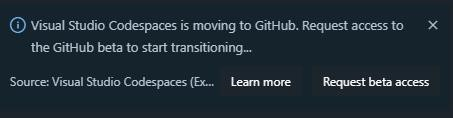

# Visual Studio Codespaces Consolidation FAQs

## What’s the general timeline?

### September 4th, 2020

- [Announcement: Visual Studio Codespaces is consolidating into GitHub Codespaces.](https://aka.ms/vscs-moving)

### November 20th, 2020

- New user sign-ups to Visual Studio Codespaces are suspended.

- Plan and codespace creation are suspended.

- Users in the Azure service can still connect to their existing codespaces through the [portal](https://online.visualstudio.com/login) to access and backup any data. 

### February 17, 2021

- The service is retired.

- All remaining plans and codespaces in the [portal](https://online.visualstudio.com/login) are deleted.

- The [portal](https://online.visualstudio.com/login) is deleted.

## Are any features not moving over to GitHub?

As we move the service over and continue to gather feedback from beta customers, we are evaluating what makes sense to migrate. We’ll be updating this answer as retirement decisions are made.

### 9/4/2020

#### Self-hosted codespaces 

Users will not be able to register new self-hosted machines when the service suspends codespace creation on 11/20/2020.

Self-hosted is not currently included in the GitHub service, but we will be listening to feedback to inform our roadmap.

## What happens to Private Preview users in VS and Windows SKU?

The Private Preview for Visual Studio and Windows SKU support will be moving over to GitHub as part of the service consolidation. We will continue to support the Private Preview in the current service until the consolidation is complete, at which point all Private Preview users will be onboarded to GitHub Codespaces for the remainder of the preview.

## Will GitHub Codespaces be more expensive than Visual Studio Codespaces? 

There is no charge for GitHub Codespaces while it is in limited public beta. Final pricing for GitHub Codespaces will be announced when Codespaces reaches general availability, which is expected later this year. For more information, see the [GitHub docs](https://docs.github.com/en/github/developing-online-with-codespaces/about-codespaces#about-billing-for-codespaces).

## I’m a current Visual Studio Codespaces user, how do I move to the GitHub beta? 

1. Provide the GitHub account you’d like to be added to GitHub Codespaces beta. We will contacting you in one of the following ways in the coming weeks:
    1. Subscription owners should submit their information via the form indicated in the service retirement announcement e-mail.
    1. Upon connection to a Visual Studio Codespace, you’ll be prompted via a notification toast to provide your information.
    
    1. If you are having difficulties, please [contact us](mailto:vscs-transition-help@microsoft.com). 

1. Once you are added to the GitHub Codespaces beta, you’ll be able to create a codespace directly from any of your GitHub repositories.  

## Is there any way to migrate my current Codespaces over to the GitHub experience?
There is not a way to move Visual Studio Codespaces over to GitHub Codespaces. You will need to re-create your codespaces once you gain access to the GitHub Codespaces beta. Check out the [beta docs](https://docs.github.com/en/github/developing-online-with-codespaces) on GitHub for more information.

## I'm currently using a different service to host my repositories, e.g. Azure Repos, Bitbucket, etc. Can I still use that with GitHub Codespaces?
While GitHub Codespaces provides an optimized creation experience for GitHub repositories, we are currently iterating on the experience for repositories hosted elsewhere and will keep you updated as plans formalize.

In the meantime, we want to propose two workarounds that are already possible today.

> [!NOTE] 
> The following guidance pertains to customers utilizing Visual Studio Code or the browser experience. For our private preview users in Visual Studio, stay tuned for updates as we continue to iterate on your experience.

### Utilize the universal image with Codespaces
If your repository doesn’t require extra [customization](../reference/configuring.md), you can leverage our universal image to get started quickly.

1. Sign in to [GitHub](https://github.com/) using the account with Codespaces beta access.
1. [Create](https://docs.github.com/en/github/creating-cloning-and-archiving-repositories/creating-a-new-repository) a new GitHub repository and add at least one file (e.g. README). Codespaces cannot be created off empty repositories.
1. [Create a codespace](https://docs.github.com/en/github/developing-online-with-codespaces/creating-a-codespace) by clicking the Code drop-down button on the mirrored repository main page and then selecting Open with Codespaces.
1.. Once connected to the codespace, [clone](https://code.visualstudio.com/docs/editor/versioncontrol#_cloning-a-repository) the repository you’d like to work with.

### Mirror your repository to GitHub

This workflow will allow you to leverage [customization](../reference/configuring.md) via a devcontainer.json or Dockerfile in your repository. However, you’ll need to manually re-sync changes between the original and mirrored repositories or setup a CI task to automate the sync process.

1. Sign in to [GitHub](https://github.com/) using the account with Codespaces beta access.
1. [Create](https://docs.github.com/en/github/creating-cloning-and-archiving-repositories/creating-a-new-repository) a new GitHub repository and add at least one file (e.g. README). Codespaces cannot be created off empty repositories.
1. [Mirror](https://docs.github.com/en/github/creating-cloning-and-archiving-repositories/duplicating-a-repository) your repository to this new GitHub repository.
1. [Create a codespace](https://docs.github.com/en/github/developing-online-with-codespaces/creating-a-codespace) by clicking the Code drop-down button on the mirrored repository main page and then selecting Open with Codespaces.
