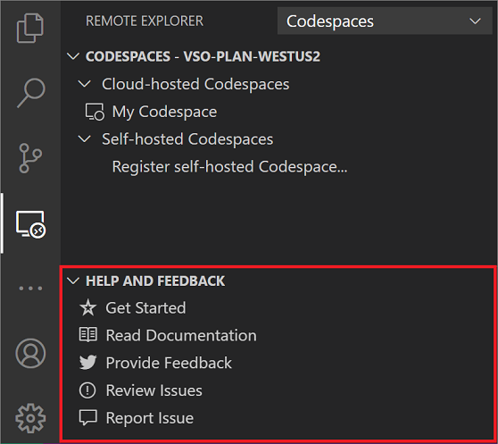

# Feedback & Support

> [!IMPORTANT] 
> Visual Studio Codespaces is being consolidated into [GitHub Codespaces](https://github.com/features/codespaces). New user signups and codespace creation suspended on December 16th, 2020. The service will be retired and all data deleted on February 17th, 2021. See our [FAQs](https://docs.microsoft.com/visualstudio/codespaces/resources/consolidation-faq#im-a-current-visual-studio-codespaces-user-how-do-i-move-to-the-github-beta) for guidance on your transition to GitHub Codespaces.

Feedback for Visual Studio Codespaces is collected in [our documentation repository on GitHub](https://github.com/MicrosoftDocs/vsonline/).

- **Issues**: Feel free to search through the list of [open bugs](https://github.com/MicrosoftDocs/vsonline/labels/bug) and [feature enhancements](https://github.com/MicrosoftDocs/vsonline/labels/enhancement), and certainly don't hesitate to [submit your own](https://github.com/MicrosoftDocs/vsonline/issues/new), or up vote one with a 👍🏻 reaction!
- **Feedback Area Map**: Looking to get a general feel for what we're working on and looking for feedback about? Check out the [feedback area map](https://github.com/MicrosoftDocs/vsonline/issues/2).
- **Twitter**: Interact with us on Twitter! Just be sure to use the [#vsonline](https://twitter.com/search?q=%23vsonline&src=typed_query&f=live) hashtag.
- **Billing**: For support with billing inquiries, see the [Azure Help + support blade](https://portal.azure.com/#blade/Microsoft_Azure_Support/HelpAndSupportBlade).

## In Visual Studio Code

Look for the **Help and Feedback** panel in the **Remote Explorer** for a quick and easy way to interact with our feedback channels.

